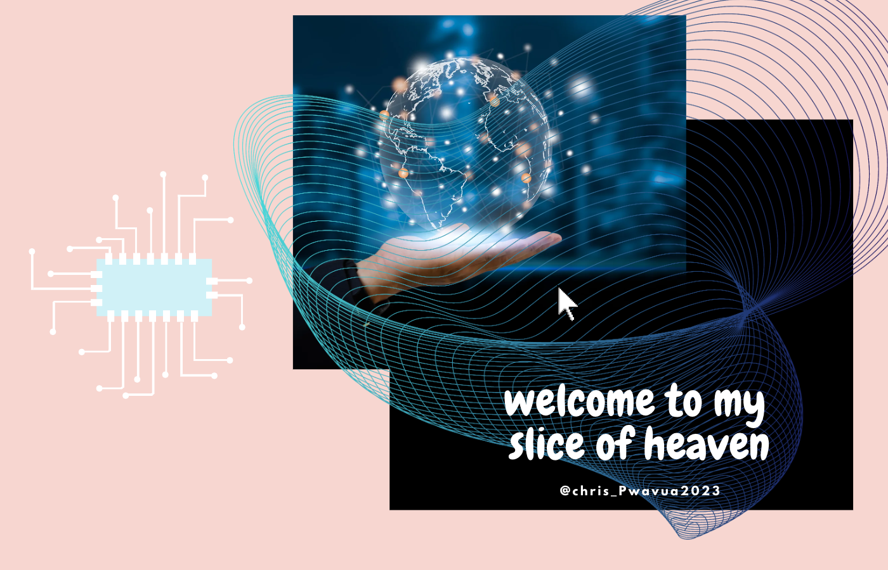

### Bonjour 👋

    

    <h3 align="center"> :computer: Wavua here, alias=Chris_P :computer:</h3>

    

    <h3 align="center"> :two_hearts: Futuristic :milky_way: Techie  :two_hearts:</h3>

<!--
**WavuaW/WavuaW** is a ✨ _special_ ✨ repository because its `README.md` (this file) appears on your GitHub profile. 

Here are some ideas to get you started:
-->

- 🔭 I’m currently working on **Javascript, Python**

- 🌱 I’m currently learning Node.js & the Backend
- 👯 I’m looking to collaborate on ML AL and other fun projects
- 🤔 I’m looking for help with ...
- 💬 Ask me about ...
- 📫 How to reach me: **wavuamuroka@gmail.com
- ⚡ Fun fact: I am an artist

